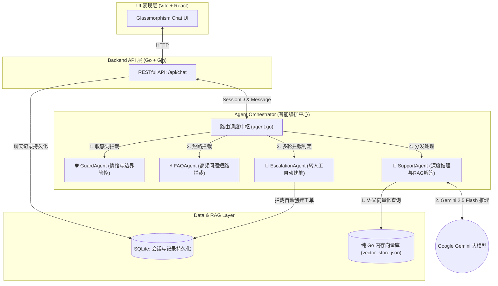
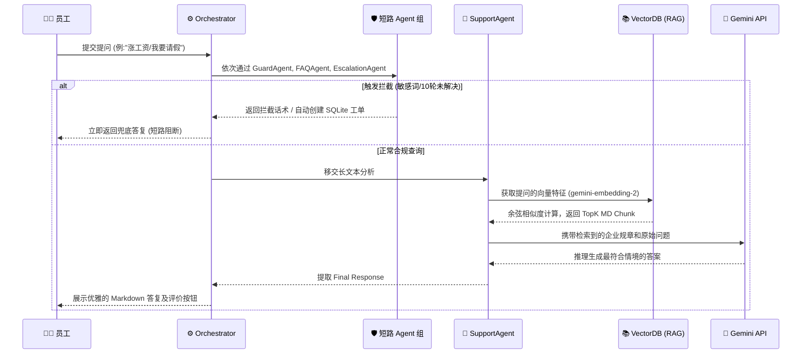

# OmniDesk 🚀
企业内部智能服务台 Agent

OmniDesk 是一个基于大模型构建的现代化、智能化的企业内部客服中心。它采用 **Multi-Agent (多智能体)** 架构，结合**本地零依赖 RAG (检索增强生成)** 引擎，能够快速帮员工解答 HR 政策、IT 故障排查等问题。同时包含严格的对话防护机制并在无法解决时自动创建工单。

## 📸 Demo 演示


---

## 🏗 Multi-Agent 架构图

OmniDesk 采用前后端分离的现代化架构，底座依托强大的 Google ADK (Agent Development Kit)。重构后，系统从单体 Agent 进化为了职责分离的多智能体协同网络：



## 🔄 Agent 核心工作流程图

当员工在 Web 界面发起提问时，Orchestrator 会自动调度不同职责的 Agent 进行流式处理：



### 流程原理解析

为了打造极其轻量却又符合企业级标准的智能客服，我们实现了以下三大核心特性：

1. **纯 Go 本地向量检索引擎 (Zero-Dependency RAG)**：完全抛弃了笨重的外部数据库 (如 Chroma、Milvus)。每次服务启动时，系统会自动切分 `data/knowledge/` 下的 Markdown 文档，通过 `gemini-embedding-2` 转化为高维向量，并利用我们在内存中徒手实现的余弦相似度算法进行毫秒级匹配。
2. **多智能体各司其职 (Multi-Agent Orchestration)**：抛弃了让大模型承担所有压力的单体架构。诸如“辱骂拦截”、“高频固定问答”以及“强制工单升级（10轮防杠机制）”全部被前置到了极低开销的子智能体中处理，只有真正复杂的企业政策疑问才会交由 `SupportAgent` 进行昂贵的 LLM 推理。
3. **闭环的数据留存体系**：不管是用户的点赞(👍)、踩(👎) 及反馈意见，还是触发转交人工时生成的 ITIL 工单 (Ticket)，包括每一次对话的轮次上下文，都会被持久化保存在本地轻量的 SQLite 库中，作为日后系统评测与审计的依据。

---

## 🛠 快速启动

1. **配置环境变量**
   配置 Gemini API Key 以驱动大模型推理与 RAG 向量化引擎。
   ```bash
   export GEMINI_API_KEY="您的真实密钥"
   ```

2. **启动后端服务**
   后端服务采用 Go + Gin 驱动，且原生内置了所有引擎，真正的单体编译，无需配置外部环境！
   ```bash
   cd OmniDesk
   go run cmd/server/main.go
   # 服务将运行在 http://localhost:8082
   ```

3. **启动前端可视化面板**
   前端基于 Vite + React 打造，实现了 Glassmorphism (毛玻璃) 沉浸式动效设计，并内置了完整的 Markdown / 代码块解析能力。
   在新终端窗口中运行：
   ```bash
   cd OmniDesk/web
   npm install
   npm run dev
   # 浏览器访问 http://localhost:5173 即可体验
   ```
