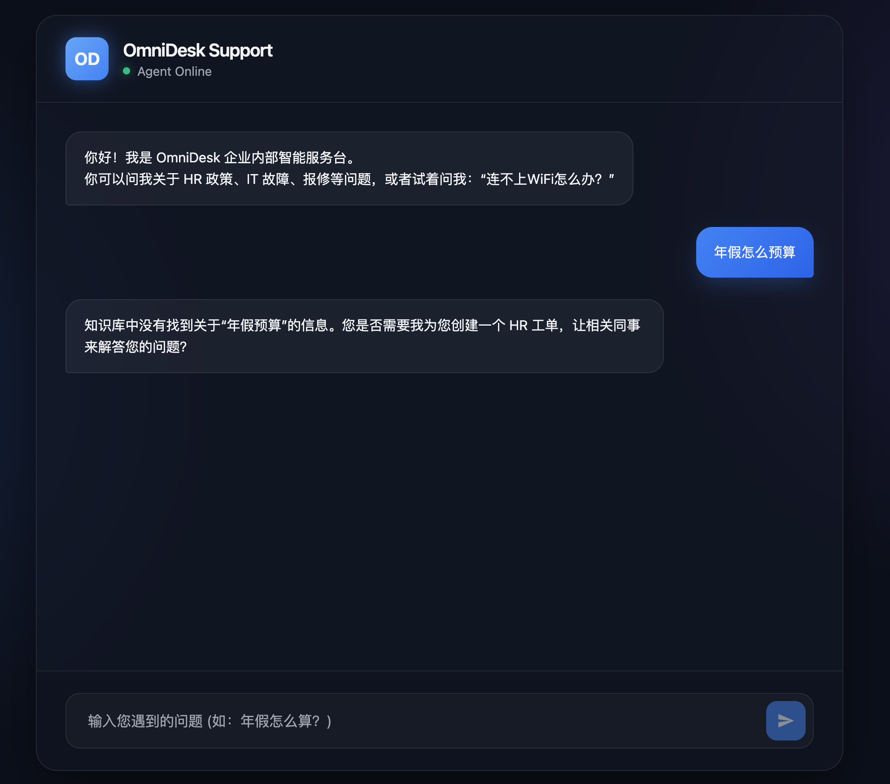
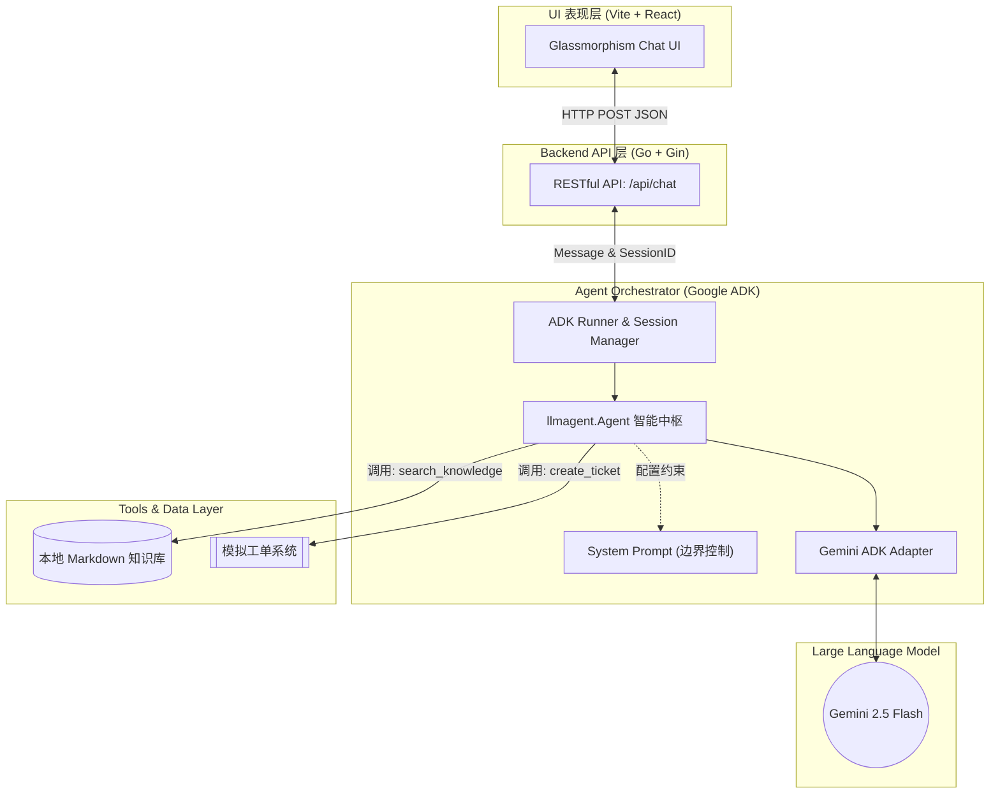
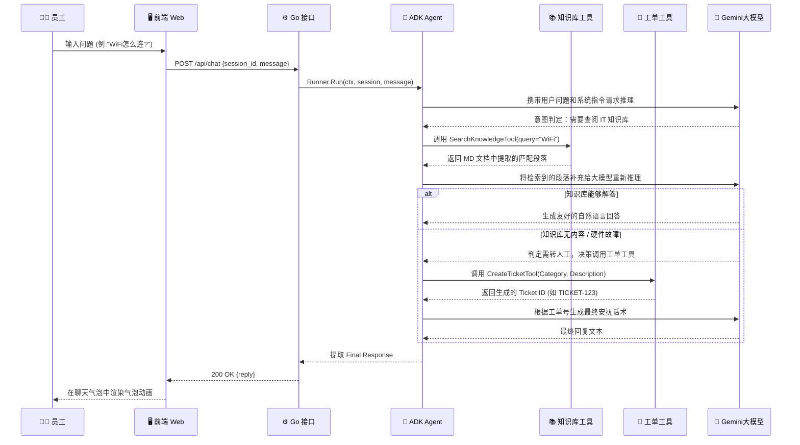

# OmniDesk 🚀
企业内部智能服务台 Agent

OmniDesk 是一个基于大模型构建的现代化、智能化的企业内部客服中心。它旨在帮助企业员工快速获取 HR 政策、IT 故障排查支持，并在无法自行解决时自动为您创建工单。

## 📸 Demo 演示



*(请将上方的截图保存为 `docs/demo.png`)*

---

## 🏗 模块化架构图

OmniDesk 采用前后端分离的现代化架构，底座依托于强大的 Google ADK (Agent Development Kit) 框架。



## 🔄 Agent 核心工作流程图

当员工在 Web 界面发起提问时，Agent 会自主进行意图识别、搜索推理和行动决策。



### 流程原理解析

为了让上方的交互时序图更易理解，以下是 Agent 的三大核心处理机制：

1. **意图识别与分发**：当员工在前端页面发送请求时，后端的 Gemini 大模型会首先根据预设的 `System Prompt` 分析用户意图，判断该问题是否属于企业客服范畴，并自主决定下一步该调用哪个工具。
2. **知识库检索 (RAG)**：对于“年假怎么算”、“访客WiFi怎么连”等政策性查询问题，Agent 会自动提取核心关键词并调用 `SearchKnowledgeTool`，从本地知识库中抓取关联的文档段落，然后再将这些段落交给大模型润色，生成最友好的自然语言回复。
3. **自动化工单创建**：当员工遇到“电脑蓝屏”、“网络设备损坏”等明显超出知识文档解决范围的物理故障时，Agent 会敏锐地判定此问题需要人工介入，并立刻触发调用 `CreateTicketTool`，在后台自动生成一个附带故障现象的 IT 工单，最后将工单号和安抚话术反馈给员工。

---

## 🚀 未来生产环境演进计划 (Production Roadmap)

为了将当前的 Demo 落地为真正的企业级生产应用，我们规划了以下三个维度的演进方向：

### 1. 接入企业级知识库 (Enterprise Knowledge Base)
目前的知识库基于本地 Markdown 文件进行关键词检索。在生产环境中，我们将升级为：
- **向量数据库接入**: 引入 Qdrant 或 Milvus，将企业内部庞大的飞书/钉钉文档库、Wiki 沉淀进行 Chunking 和向量化 (Embedding)。
- **混合检索 (Hybrid Search)**: 结合关键词 (BM25) 与语义检索，大幅提升在处理“年假计算”、“报销流程”等长尾问题的召回率和准确度。
- **权限隔离**: 接入企业 SSO，使得 Agent 能够在检索时区分不同职级和部门员工的文档访问权限。

### 2. 对接真实工单系统 (Ticket System Integration)
目前的工单生成 (`CreateTicketTool`) 是一个模拟响应。在线上版本中，我们将：
- **API 深度集成**: 调用企业内部 Jira、Zendesk 或自研 ITIL 工单系统的 OpenAPI。
- **自动携带上下文**: Agent 在调用创建工单接口时，自动汇总此前的多轮对话摘要、判断的问题分类（如“网络设备”、“薪酬福利”）以及员工账号信息，避免员工向人工客服重复描述问题。
- **进度追踪查询**: 提供一个 `CheckTicketStatusTool`，让员工可以随时向 OmniDesk 询问“我的电脑报修现在到哪一步了？”

### 3. 智能人工转交机制 (Human Agent Handoff)
当遇到 AI 绝对无法处理的边界问题（如严重的生产系统故障、员工情绪激动），必须具备平滑升级至人工客服的能力：
- **情绪监测与自动转交**: 当模型感知到用户强烈的负面情绪，或连问三次仍未解决问题时，主动中断自动化流程，触发人工转交协议。
- **WebSocket 坐席接管**: 在保留当前 Web 会话窗口不断开的情况下，通过 WebSocket 将底层应答流从 Gemini 引擎静默切换为真实客服坐席。
- **客服 Copilot 赋能**: 转交后，人工客服的后台能够看到 AI 预先生成的“问题根因分析 (RCA)”草稿和建议话术，从而提升人工处理的效率。

---

## 🛠 快速启动

1. **配置环境变量**
   您需要配置 Gemini API Key 以驱动大模型推理引擎。
   ```bash
   export GEMINI_API_KEY="您的真实密钥"
   ```

2. **启动后端服务**
   ```bash
   cd OmniDesk
   go run cmd/server/main.go
   # 服务将运行在 http://localhost:8081
   ```

3. **启动前端可视化面板**
   在新终端窗口中运行：
   ```bash
   cd OmniDesk/web
   npm install
   npm run dev
   # 浏览器访问 http://localhost:5173 即可体验
   ```
